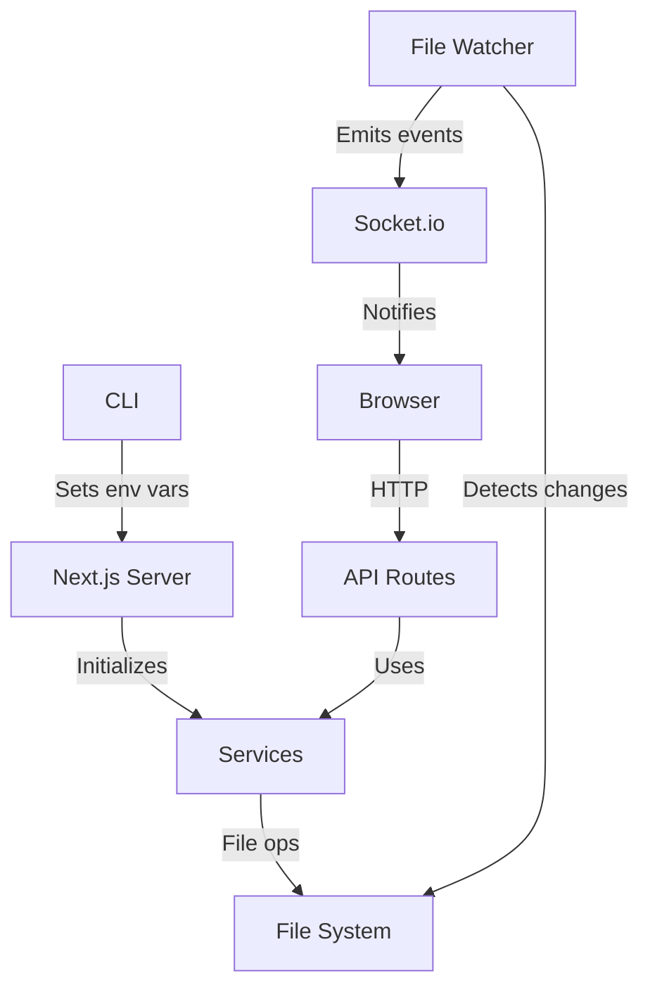

# Architecture

Smart Docs is a Next.js 15 application with a CLI entry point.

## Project Structure

```
smart-docs/
├── app/                      # Next.js app directory
│   ├── page.tsx              # Main page component
│   ├── layout.tsx            # Root layout
│   ├── api/                  # API routes
│   │   ├── config/           # GET server config
│   │   └── docs/             # Documentation CRUD
│   │       ├── tree/         # GET file tree
│   │       └── content/      # GET/PUT/POST/DELETE files
│   └── components/           # React components
│       ├── DocsTab.tsx       # Main UI with editing
│       ├── Mermaid.tsx       # Diagram rendering
│       ├── Modal.tsx         # Base modal component
│       ├── Toast.tsx         # Notifications
│       └── ConfirmDialog.tsx # Confirmation dialogs
├── server/                   # Server-side code
│   ├── config.ts             # Configuration loader
│   └── services/             # Singleton services
│       ├── index.ts          # Service initialization
│       ├── file-watcher.ts   # Chokidar file watching
│       └── markdown-service.ts # File operations
├── types/                    # TypeScript definitions
│   └── index.ts              # Shared types
├── bin/                      # CLI
│   └── cli.ts                # Entry point
└── docs/                     # This documentation
```

## Key Components

### CLI (`bin/cli.ts`)

The CLI is the entry point:

1. Parses command-line arguments
2. Resolves the docs path
3. Sets environment variables
4. Spawns Next.js server
5. Waits for server readiness
6. Optionally opens browser

### Services

Services are singletons initialized once at startup:

**MarkdownService**
- Builds file tree from docs directory
- Reads markdown files with frontmatter parsing
- Writes files with frontmatter serialization
- Handles create/delete operations

**FileSystemWatcher**
- Uses Chokidar to watch for file changes
- Emits events on file add/change/delete
- Enables real-time UI updates via Socket.io

### API Routes

Next.js API routes provide the REST interface:

```
GET  /api/config        → Server configuration
GET  /api/docs/tree     → File tree structure
GET  /api/docs/content  → Read file
PUT  /api/docs/content  → Update file
POST /api/docs/content  → Create file
DELETE /api/docs/content → Delete file
```

### React Components

**DocsTab** - The main component handling:
- File tree rendering
- Markdown preview
- Edit mode with frontmatter editor
- Create/delete modals

## Data Flow



## Configuration

The app uses a single environment variable:

| Variable | Description |
|----------|-------------|
| `SMART_DOCS_PATH` | Absolute path to docs folder |

Set by the CLI, read by `server/config.ts`.

## Technology Stack

| Layer | Technology |
|-------|------------|
| Framework | Next.js 15 |
| UI | React 19, Tailwind CSS |
| Markdown | react-markdown, remark-gfm |
| Syntax | Prism.js via react-syntax-highlighter |
| Diagrams | Mermaid |
| File watching | Chokidar |
| Real-time | Socket.io |
