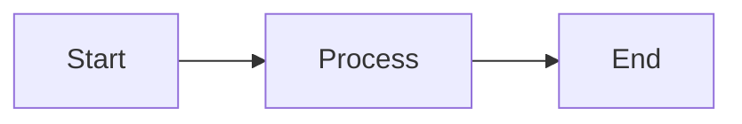

# Viewing Documentation

Smart Docs renders markdown files with full formatting support.

## File Tree Navigation

The left sidebar displays your documentation structure:

- **Folders** - Click to expand/collapse, shown with 📁
- **Files** - Click to view content, shown with 📄
- Files are sorted alphabetically with folders first

## Markdown Rendering

Full GitHub-flavored markdown support:

- **Headings** - `# H1` through `###### H6`
- **Emphasis** - `*italic*`, `**bold**`, `~~strikethrough~~`
- **Lists** - Ordered, unordered, and task lists
- **Links** - `[text](url)` and auto-linked URLs
- **Images** - ``
- **Tables** - GitHub-style tables
- **Blockquotes** - `> quoted text`

## Syntax Highlighting

Code blocks are highlighted automatically:

~~~markdown
```javascript
function hello() {
  console.log('Hello, world!');
}
```
~~~

Supported languages include JavaScript, TypeScript, Python, Go, Rust, and many more via Prism.js.

## Mermaid Diagrams

Create diagrams using Mermaid syntax:

~~~markdown

~~~

Supported diagram types:
- Flowcharts
- Sequence diagrams
- Class diagrams
- State diagrams
- Entity relationship diagrams
- And more

## Frontmatter

YAML frontmatter at the top of files is parsed and displayed:

```markdown
---
title: My Document
description: A brief description
author: Jane Doe
---

# Content starts here
```

The `title` and `description` fields are displayed in a header box above the content.
