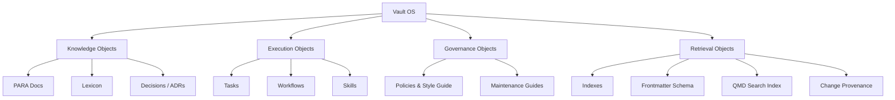
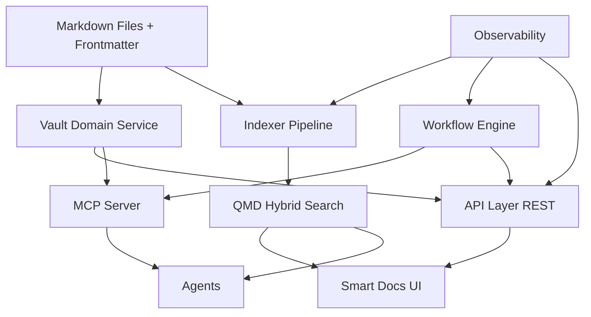
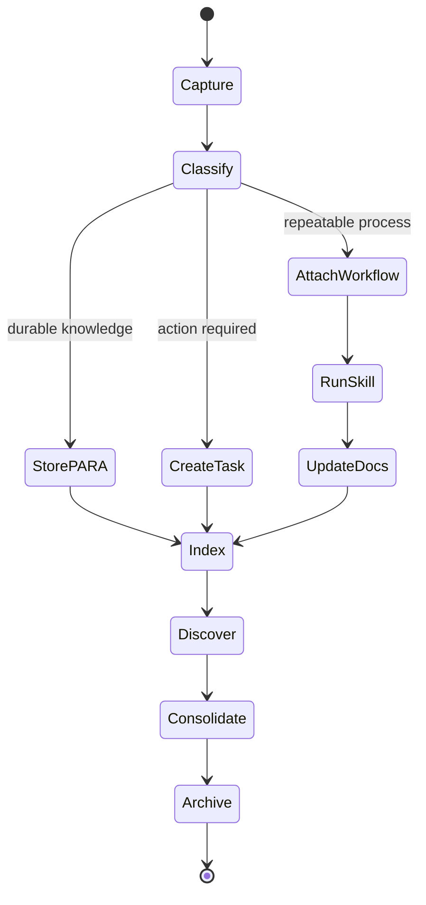
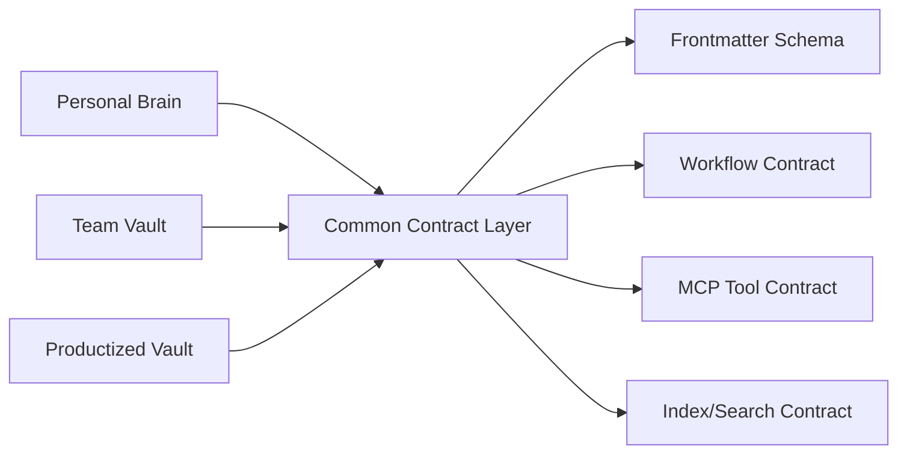
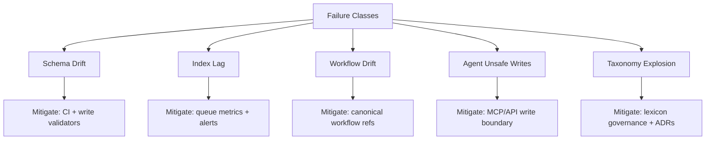

# Vault Operating System Proposal (v1)

## Why this proposal

Smart Docs already has strong primitives: markdown CRUD, frontmatter, real-time sync, and agent auto-load. The next step is to turn it into a **Vault Operating System** for teams and agents that need consistent, durable, and searchable knowledge.

This proposal defines the core direction and links to the expanded proposal suite:
- [Vault OS Proposal Suite Index](vault-os/index.md)
- [Product Definition](vault-os/01-product-definition.md)
- [App Spec](vault-os/02-app-spec.md)
- [Claude Plugin + MCP Context Strategy](vault-os/03-plugin-and-mcp-context.md)
- [Information Model + Metadata Standards](vault-os/04-information-model.md)
- [Operating Guides + Maintenance](vault-os/05-operating-guides.md)
- [Vault CLI Spec (Bun-first)](vault-os/08-vault-cli-spec.md)

---

## Current state (what exists now)

Smart Docs currently provides:
- docs folder browsing + editing,
- frontmatter support,
- live file watching,
- REST API for file tree/content,
- plugin support for agent context auto-load.

That is an excellent base. What is missing is a first-class operating framework for **PARA + tasks + skills + workflows + retrieval + governance**.

---

## Scope and design goals

### Goals
1. Keep markdown files as the source of truth.
2. Support both humans and agents as first-class operators.
3. Keep the system extensible without becoming abstract/bloated.
4. Make retrieval and maintenance measurable (observable).
5. Standardize definitions and maintenance playbooks.

### Non-goals (v1)
- Replacing git as primary content source.
- Building an all-in-one PM suite.
- Perfect ontology from day one.

---

## Concept model (canonical objects)

Your proposed objects are correct and close to complete:
- PARA buckets (`projects`, `areas`, `resources`, `archives`)
- tasks
- skills
- workflows

Recommended additions:
- **Lexicon**: canonical definitions for terms/taxonomy
- **Indexes**: generated navigation and retrieval surfaces
- **Decisions (ADRs)**: major architecture/operating decisions
- **Provenance**: who/what changed what + confidence/source
- **Policies**: style, metadata, and maintenance rules

### Canonical object taxonomy



---

## Layered architecture



### Layer responsibilities
- **Content layer**: markdown + frontmatter + folder conventions.
- **Domain layer**: validated create/read/update/move/link operations.
- **Access layer**: REST for UI, MCP for agents.
- **Retrieval layer**: indexing + lexical/semantic search + filtering.
- **Execution layer**: workflows and skills acting on domain APIs.
- **Observability layer**: freshness, failures, drift, run health.

---

## Information lifecycle (operational model)



### Operational rules
1. Agents write through the domain/API boundary (not raw file writes by default).
2. Every durable file has frontmatter conforming to schema.
3. Tasks and workflows link back to source docs.
4. Indexing is async but status is visible in UI.
5. Stale/duplicate/orphaned docs are reviewed on cadence.

---

## Recommended folder contract (v1)

```text
docs/
  index.md
  proposals/
    vault-operating-system.md
  standards/
    lexicon.md
    frontmatter-schema.md
    style-guide.md
    maintenance-guide.md
  para/
    projects/
    areas/
    resources/
    archives/
  tasks/
    index.md
  workflows/
    index.md
    templates/
  skills/
    index.md
  decisions/
    ADR-0001-*.md
```

> Note: If PARA should live at repo root instead of `docs/para`, keep a single canonical location and link to it from docs. Avoid dual copies.

---

## Metadata standard (frontmatter v1)

Minimum required fields:
- `title`
- `type` (`project|area|resource|archive|task|workflow|skill|decision|lexicon|guide`)
- `status` (`draft|active|stable|archived`)
- `updated_at` (ISO timestamp)

Recommended fields:
- `tags`
- `owners`
- `related` (doc links)
- `source` (human/agent/import + provenance)
- `review_by` (maintenance date)

---

## UX model (special treatment in app)

The app should provide role-based views by doc type:
- **PARA View**: bucket navigation + health indicators
- **Task View**: actionable list, status, due windows
- **Workflow View**: templates, versions, run history
- **Skill View**: available skill docs and compatibility
- **Decision View**: ADR timeline and dependency graph
- **Lexicon View**: canonical term definitions + backlinks

---

## API and MCP expansion

### API additions
- `GET /api/vault/search`
- `GET /api/vault/index-status`
- `POST /api/vault/validate`
- `POST /api/vault/move`
- `POST /api/vault/link`

### MCP tool set (v1)
- `vault.search(query, filters)`
- `vault.get(path_or_id)`
- `vault.create(type, title, body, metadata)`
- `vault.update(path_or_id, patch)`
- `vault.move(path_or_id, bucket)`
- `vault.link(from, to, relation)`
- `vault.validate(path_or_id)`

---

## What to standardize as “framework-provided”

Yes — provide formal guides for all core concepts:
- when to create projects vs areas,
- where notes go,
- when a recurring process becomes a workflow,
- when to convert guidance into a skill wrapper,
- how to review and archive.

This should be distributed as:
1. **Lexicon** (definitions)
2. **Maintenance guide** (cadence/checklists)
3. **Style guide** (writing quality + mermaid conventions)
4. **Workflow templates** (execution standards)
5. **Skill wrappers** for high-frequency operations

---

## Deep design: portability model and tradeoffs

### Portability targets

We should explicitly support three portability targets from day one:
1. **Personal brain** (single user, local-first)
2. **Team vault** (shared knowledge + role boundaries)
3. **Productized vault** (multi-tenant SaaS/integration use)



### What must be portable vs local

| Domain | Portable (framework) | Local (instance/project) |
|---|---|---|
| Taxonomy | object types + semantics | tags, naming choices |
| Metadata | required schema keys | optional custom fields |
| Workflows | state machine + gate contract | team-specific step details |
| Skills | wrapper interface | tool/provider bindings |
| Retrieval | query/filter API contract | index backend tuning |
| Governance | review cadence model | thresholds/SLO values |

### Architecture options (with pros/cons)

| Option | Description | Pros | Cons | Recommendation |
|---|---|---|---|---|
| A: Markdown-only app | UI + basic file ops | fast, simple | weak retrieval/governance | good prototype only |
| B: Markdown + QMD + MCP | current target model | strong agent utility, portable | requires contract discipline | **best v1** |
| C: Full DB-first CMS | relational primary store | powerful querying | high migration + lock-in | defer until scale proves need |

### Why Option B is the right balance
- Keeps source-of-truth human and git-compatible.
- Gives agent-grade access via MCP without exposing raw mutation paths.
- Lets us evolve indexing/retrieval independently of source content.

---

## Governance system design (formal definitions + controls)

### Core control points
1. **Schema gate**: all writes validated at boundary.
2. **Classification gate**: each object must have `type` and `status`.
3. **Linkage gate**: tasks/workflows/decisions must link to context docs.
4. **Review gate**: stale docs routed into maintenance queue.
5. **Release gate**: contract changes require ADR + migration note.

### Contract versioning policy
- `schema_version` in frontmatter for managed docs.
- MCP tools versioned (`vault.v1.*`).
- Workflow template version tags (`wf-template:v1`).
- Breaking changes require migration guide and compatibility window.

---

## Failure-mode analysis (what can go wrong)



### Operational SLOs (proposal)
- Index freshness: P95 < 5 minutes after write.
- Validation pass rate: > 99% for managed writes.
- Broken-link ratio: < 1% of managed docs.
- Stale-doc backlog: < 10% older than review window.

---

## Information model detail (beyond PARA)

To avoid ambiguity, treat PARA as the **knowledge placement** model, not the full operating ontology.

### Full ontology buckets
1. **Knowledge**: PARA docs, references, notes
2. **Execution**: tasks, workflows, runs
3. **Governance**: policies, lexicon, ADRs
4. **Retrieval**: indexes, search configs, provenance

This distinction is key for scale. PARA alone does not describe execution state or governance state.

---

## Migration strategy (from existing Smart Docs)

### Step 0: no-break baseline
- Keep existing docs CRUD and plugin behavior untouched.
- Add new capabilities as additive endpoints/docs first.

### Step 1: standards package
- Add `standards/lexicon.md`, `standards/frontmatter-schema.md`, `standards/style-guide.md`, `standards/maintenance-guide.md`.
- Add examples for each canonical object type.

### Step 2: managed-object rollout
- Introduce managed templates for task/workflow/decision/skill docs.
- Keep generic markdown docs fully supported.

### Step 3: retrieval hardening
- Add index status surfaces and stale-content diagnostics.
- Add ranking controls (freshness boost, type-aware boosts).

### Step 4: agent safety + portability hardening
- Enforce MCP write boundary for automated edits.
- Publish portability pack (contracts + templates + migration docs).

---

## Risks and mitigations

| Risk | Impact | Mitigation |
|---|---|---|
| Ontology sprawl | confusing system | keep a strict lexicon + change control |
| Metadata inconsistency | poor search/classification | schema validation in API + CI |
| Agent drift | unsafe edits | default writes via MCP/API + provenance |
| Index staleness | retrieval misses | async queue + visible index health |
| Over-complex v1 | low adoption | phased rollout + smallest useful surface |

---

## Phased roadmap

### Phase 1 (1-2 weeks): standards + docs foundation
- Add lexicon, style guide, frontmatter schema, maintenance guide.
- Add this proposal and index links.
- Define canonical folder contract.

### Phase 2 (1-2 weeks): retrieval + validation
- Add validation endpoint and metadata linting.
- Add QMD indexing integration and status endpoint.

### Phase 3 (2-3 weeks): workflow/task/skill surfaces
- Add dedicated UI tabs/views for task/workflow/skill/decision objects.
- Add MCP tools with stable contracts.

### Phase 4 (ongoing): observability and governance hardening
- Add dashboards for freshness/drift/provenance.
- Add review cadence automation.

---

## Recommendation summary

You’re not overcomplicating it — you’re converging on the right abstraction.

The right v1 is:
- **markdown + frontmatter as truth**,
- **PARA + tasks + workflows + skills + decisions + lexicon** as canonical model,
- **REST + MCP + QMD** as access/retrieval stack,
- **clear maintenance guides** to keep it healthy over time.

That gives you a reusable foundation for second brains, business knowledge hubs, and agent-operable code/project documentation systems.
