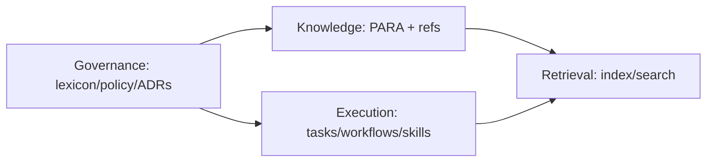

# Vault OS Product Definition

## Positioning
Smart Docs should evolve from “markdown docs viewer/editor” into a **Vault Operating System**:
- human-friendly knowledge management,
- agent-operable through stable contracts,
- portable across personal, team, and product contexts.

## Core value proposition
1. **Durable source of truth** (markdown + git-compatible)
2. **Consistent operating model** (PARA + tasks + workflows + skills + decisions + lexicon)
3. **Agent-native access** (plugin now, MCP contract next)
4. **Reliable retrieval** (QMD index + metadata + provenance)

## What belongs in the model
Your set is great and should be formalized as:
- PARA
- Tasks
- Skills
- Workflows

Additions required for long-term quality:
- Lexicon (canonical terms)
- Decisions/ADRs (why system choices were made)
- Indexes (navigability and retrieval surfaces)
- Provenance (who/what changed docs)
- Policies (style + maintenance standards)

## What to avoid
- Treating PARA as the full system ontology (it’s only placement taxonomy)
- Letting every team invent their own metadata shape
- Embedding all process in one giant doc
- Direct agent file mutation without validation boundary

## Opinionated boundary
- **Framework-provided:** schema, workflow contract, lifecycle states, review cadence, plugin/MCP contracts
- **User-customizable:** tags, templates, folder naming variants, optional metadata fields

