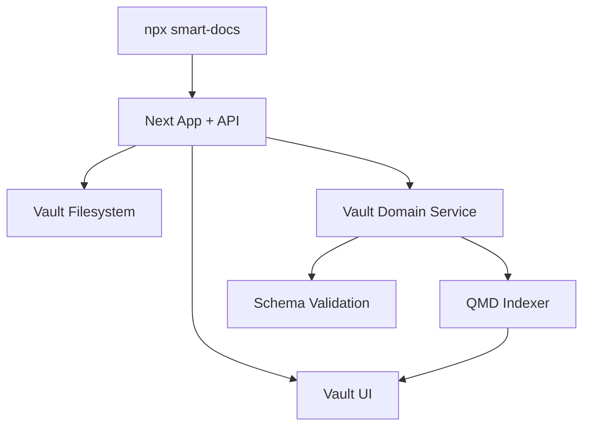

# Vault OS App Spec (npx-first)

## Current app baseline
When run via `npx @hhopkins/smart-docs ./docs`, the app currently provides:
- docs path bootstrap and server startup,
- file tree and markdown rendering,
- frontmatter-aware editing,
- real-time file watching,
- CRUD REST APIs for docs.

This is a solid base layer.

## Productized app capabilities (target)

### 1) Vault-aware navigation
- Dedicated views for:
  - PARA buckets
  - Tasks
  - Workflows
  - Skills
  - Decisions
  - Lexicon
- Type-aware badges and health indicators (stale, unlinked, missing metadata)

### 2) Retrieval and diagnostics
- Search UI with filters: type, tags, owner, status, date
- Relevance debug hints (lexical/semantic/freshness)
- Index status panel (last run, queue lag, failures)

### 3) Governance in UX
- Metadata validation warnings inline
- Doc quality checks (missing title/type/status)
- Suggested next actions (link this task to workflow, add ADR reference, etc.)

### 4) Agent operations panel
- Show what context sources are active
- Show what auto-loaded docs were injected
- Show MCP capabilities available for this vault (when enabled)

## App architecture target

## API evolution
Current docs APIs stay.
Add vault APIs incrementally:
- `/api/vault/search`
- `/api/vault/validate`
- `/api/vault/index-status`
- `/api/vault/link`
- `/api/vault/move`

## Repository topology constraints
- plugin stays in `plugins/smart-docs/**` (no relocation required for Vault OS rollout)
- documentation split should distinguish:
  - `docs/system/**` for product/framework docs
  - `docs/vault/**` for vault-shaped operational content
- detailed path plan and migration sequencing live in `09-repo-layout-and-migration.md`

## npx experience improvements
- `--preset vault-os` to scaffold folders + templates + standards
- `--with-index` to bootstrap QMD settings
- `--profile personal|team` for default policy levels
