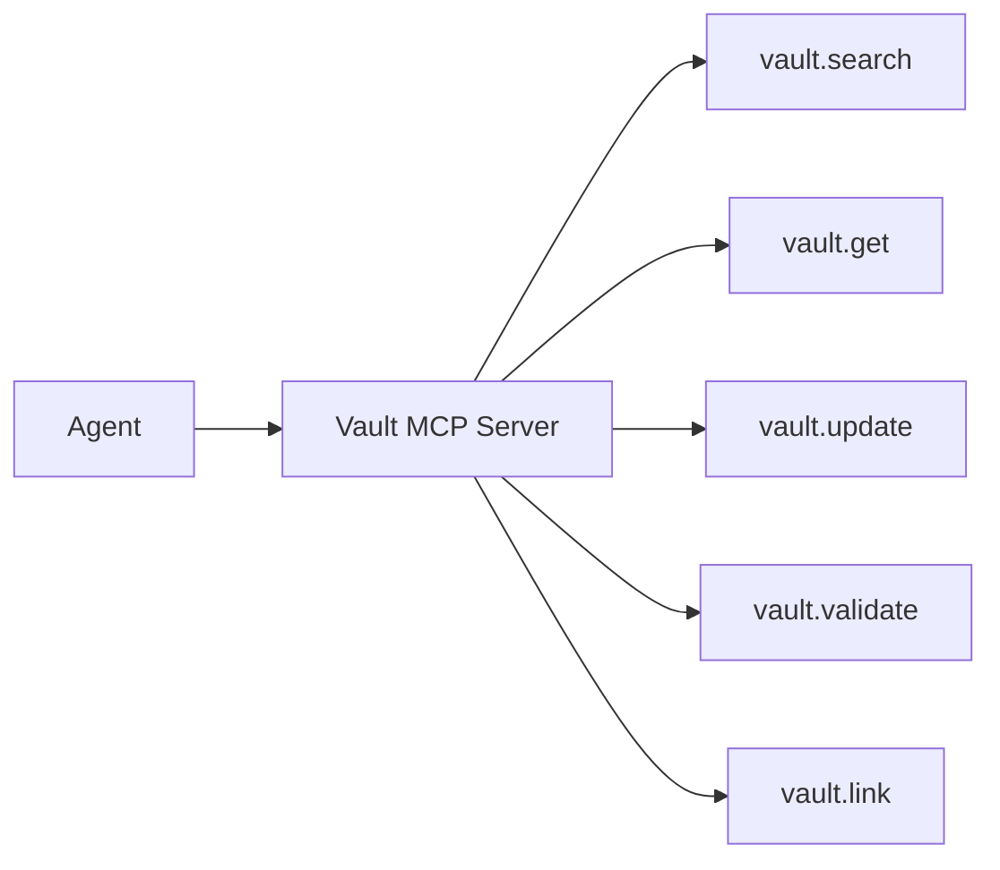

# Claude Plugin + MCP Context Strategy

## Current state
Smart Docs already includes a Claude plugin hook that:
- scans markdown files,
- reads frontmatter (`autoLoad`, `autoLoadPriority`, `agentRole`),
- injects selected docs into session-start context.

This is configurable today through frontmatter.

## Key point
There is no full MCP server contract in Smart Docs yet.
This doc defines how to evolve safely:
1. keep plugin auto-load for fast wins,
2. add MCP tool/resource contracts for structured access,
3. reduce prompt bloat by moving from bulk auto-load to query-on-demand.

## Context policy design

### Modes
- **minimal**: only lexicon + core operating docs
- **standard**: minimal + active project/workflow docs
- **deep**: standard + rich references/examples

### Priority rules
- auto-load must be bounded by a max context budget
- `autoLoadPriority` sorts within mode
- high-churn docs should default to non-autoload

## Configurability
Recommended config surface:
- repo config file (`smart-docs.config.json`)
- optional per-project overrides
- frontmatter still controls per-doc opt-in

Example:
```json
{
  "agentContext": {
    "mode": "standard",
    "maxTokens": 12000,
    "allowRoles": ["instructions", "reference"],
    "denyPaths": ["archive/**"]
  }
}
```

## MCP contract (v1 target)



Recommended initial tools:
- `vault.search(query, filters)`
- `vault.get(id_or_path)`
- `vault.create(type, title, body, metadata)`
- `vault.update(id_or_path, patch)`
- `vault.validate(id_or_path)`

## Migration sequence
1. stabilize plugin context policy + config
2. add MCP read/search tools
3. add MCP write with validation + provenance
4. switch default agent behavior to MCP query-on-demand
