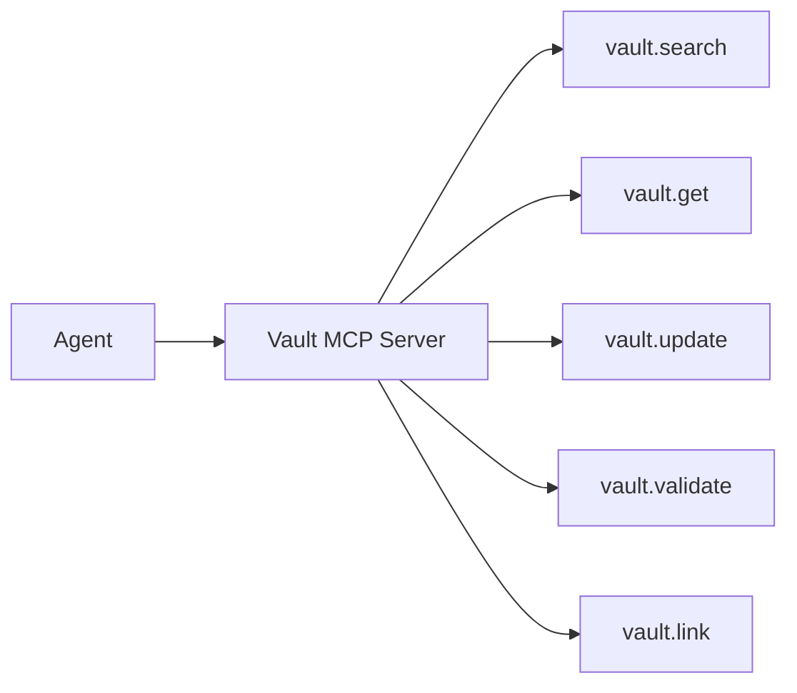

# Claude Plugin + MCP Context Strategy

## Current state
Smart Docs already includes a Claude plugin hook that:
- scans markdown files,
- reads frontmatter (`autoLoad`, `autoLoadPriority`, `agentRole`),
- injects selected docs into session-start context.

This is configurable today through frontmatter and now supports optional repo-level defaults via `smart-docs.config.json`.

## Key point
There is no full MCP server contract in Smart Docs yet.
The plugin remains in its current repository location (`plugins/smart-docs/**`).
This doc defines how to evolve safely:
1. keep plugin auto-load for fast wins,
2. add MCP tool/resource contracts for structured access,
3. reduce prompt bloat by moving from bulk auto-load to query-on-demand.

## Context policy design

### Modes
- **minimal**: only the most directive docs (`instructions` role by default), low doc cap
- **standard**: balanced default for everyday sessions (`instructions` + `reference`)
- **deep**: broad preload for research/refactoring sessions (`instructions` + `reference` + `example`)

### Mode defaults (proposal)

| Mode | Default allowed roles | Default max documents | Typical use |
|---|---|---:|---|
| `minimal` | `instructions` | 5 | fast/cheap sessions, strict guidance only |
| `standard` | `instructions`, `reference` | 20 | normal product work |
| `deep` | `instructions`, `reference`, `example` | 50 | heavy implementation/migration planning |

### Priority rules
- auto-load must remain bounded (`maxDocuments`, and later token budget)
- `autoLoadPriority` sorts within mode
- high-churn docs should default to non-autoload
- deny-paths should exclude archives/noisy history by default in larger repos

## Configurability
Recommended config surface:
- repo config file (`smart-docs.config.json`)
- optional per-project overrides in future
- frontmatter remains the per-doc opt-in switch

### Example config
```json
{
  "agentContext": {
    "mode": "standard",
    "maxDocuments": 20,
    "allowRoles": ["instructions", "reference"],
    "denyPaths": ["archives/**"]
  }
}
```

### Resolution order
1. Start with mode defaults.
2. Apply `allowRoles` override (if valid and non-empty).
3. Apply `denyPaths` override.
4. Apply `maxDocuments` override (must be positive).
5. Apply per-file frontmatter (`autoLoad: true`, plus priority/role metadata).

This preserves safe behavior when config is missing or malformed.

## MCP contract (v1 target)



Recommended initial tools:
- `vault.search(query, filters)`
- `vault.get(id_or_path)`
- `vault.create(type, title, body, metadata)`
- `vault.update(id_or_path, patch)`
- `vault.validate(id_or_path)`

## Migration sequence
1. stabilize plugin context policy + config
2. add MCP read/search tools
3. add MCP write with validation + provenance
4. switch default agent behavior to MCP query-on-demand
