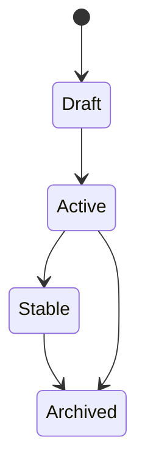

# Information Model + Metadata Standards

## Canonical object types

| Type | Purpose |
|---|---|
| `project` | time-bounded initiative with outcomes |
| `area` | ongoing responsibility domain |
| `resource` | reusable reference material |
| `archive` | inactive historical content |
| `task` | actionable unit of work |
| `workflow` | repeatable process definition |
| `skill` | agent-operable method wrapper |
| `decision` | architecture/operating decision (ADR) |
| `lexicon` | canonical concept definitions |
| `guide` | operational how-to |

## Required frontmatter (v1)
- `title`
- `type`
- `status` (`draft|active|stable|archived`)
- `updated_at`

## Recommended frontmatter
- `owners`
- `tags`
- `related`
- `source` (human/agent/import)
- `review_by`
- `schema_version`

## Classification rules
- if it changes behavior repeatedly -> `workflow`
- if it wraps execution for agents -> `skill`
- if it records strategic choice -> `decision`
- if it defines terminology -> `lexicon`

## Quality gates
- block merge on missing required fields for managed object types
- warn (not block) on missing recommended fields
- enforce link integrity for task/workflow/decision docs

