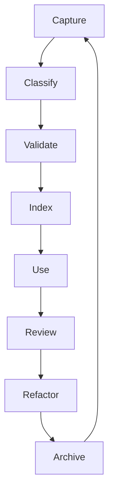

# Operating Guides + Maintenance

## Framework-provided guides (must ship)
1. **Lexicon**: formal definitions and boundaries
2. **PARA guide**: when to create project vs area vs resource vs archive
3. **Task guide**: intake, ownership, done criteria, review loop
4. **Workflow guide**: when to create, version, and retire workflows
5. **Skill guide**: wrapper rules, safety boundaries, context strategy
6. **Style guide**: writing quality, frontmatter practices, mermaid conventions
7. **Maintenance guide**: review cadences, stale cleanup, index health checks

## Maintenance loops

### Daily
- task hygiene
- capture and classify new docs

### Weekly
- workflow/skill drift check
- stale-doc review
- unresolved decision follow-ups

### Monthly
- lexicon audit
- schema and template review
- archive/prune cycle

## What “portable” means operationally
- same object semantics across repos
- same metadata contracts
- same workflow state model
- same MCP tool contracts
- local customization only in optional fields/policies

## Rollout checklist
- [ ] publish lexicon + schema docs
- [ ] publish templates per object type
- [ ] enable validation in CI
- [ ] add index status visibility in app
- [ ] define plugin/MCP context policy defaults
- [ ] add governance owners
