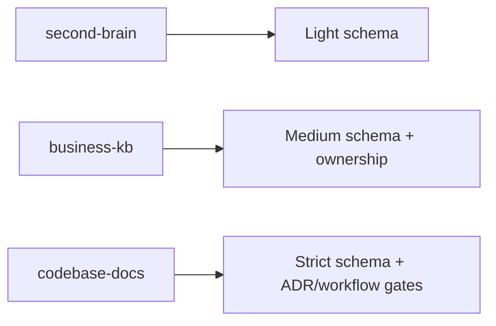

# Vault Presets

## Why presets
A single ontology is good; a single operational profile is not.
Presets let us keep one model while changing defaults for different contexts.

## Preset matrix

| Preset | Best for | Emphasis | Default strictness |
|---|---|---|---|
| `second-brain` | personal knowledge | capture, reflection, retrieval | low-medium |
| `business-kb` | team/company docs | consistency, ownership, review cadence | medium-high |
| `codebase-docs` | engineering repos | architecture, ADRs, runbooks, API docs | high |

## `second-brain`
- Prioritize quick capture and lightweight metadata
- Optional tasks/workflows
- Weekly consolidation preferred over heavy governance

## `business-kb`
- Required owner/status/review fields
- Strong taxonomy and lexicon controls
- Monthly stale-content + broken-link audits

## `codebase-docs`
- Required ADR links for major architecture docs
- Workflow templates for incident/runbook/update flows
- API and system diagrams expected for critical components
- CI metadata/lint checks enabled by default

## Recommended defaults by preset



## CLI direction (proposal)

```bash
npx @hhopkins/smart-docs ./docs --preset second-brain
npx @hhopkins/smart-docs ./docs --preset business-kb
npx @hhopkins/smart-docs ./docs --preset codebase-docs
```

Each preset should scaffold:
- folder structure,
- starter templates,
- metadata policy,
- maintenance checklist,
- plugin context defaults.
