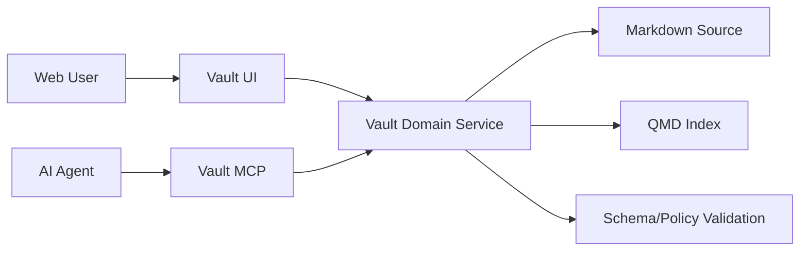

# Action Surface: Web App + MCP

This document defines the canonical actions users and agents should be able to perform.

## Shared core actions (Web + MCP)

| Action | Description |
|---|---|
| `search` | Hybrid retrieval with filters (type/tags/status/date/owner) |
| `get` | Read a document by id/path |
| `create` | Create document from type/template |
| `update` | Update content and/or metadata |
| `move` | Move document across folders/PARA buckets |
| `rename` | Rename title/path with link safety checks |
| `delete` | Soft-delete/archive (hard delete restricted) |
| `link` | Create semantic relation between docs |
| `validate` | Validate metadata/schema/link integrity |
| `list` | List tree/folder/document structure |

## Web app-first actions

- bulk select / bulk move / bulk archive
- drag-and-drop organization
- visual diff/history view
- frontmatter form editor with lint hints
- index health dashboard (lag/failures/coverage)
- stale docs and broken link diagnostics
- workflow/task board visualization
- preset scaffolding wizard

## MCP-first actions (v1 contract)

- `vault.search(query, filters, topK)`
- `vault.get(idOrPath)`
- `vault.create(type, title, body, metadata)`
- `vault.update(idOrPath, patch)`
- `vault.move(idOrPath, target)`
- `vault.link(from, to, relation)`
- `vault.validate(idOrPath)`
- `vault.list(path, depth?)`
- `vault.indexStatus()`
- `vault.enqueueIndex(paths?)`

## Suggested v2 actions

- `vault.suggestLinks(id)`
- `vault.traceProvenance(id)`
- `vault.summarize(pathOrQuery)`
- `vault.promoteToTask(id)`
- `vault.promoteToWorkflow(id)`

## Safety and policy notes

- Prefer soft-delete (archive) by default.
- Automated writes should go through MCP/API validation boundaries.
- Link-changing operations should trigger backlink rebuild and index enqueue.
- Potentially destructive operations (`delete`, bulk move) should support dry-run and confirmation modes.

