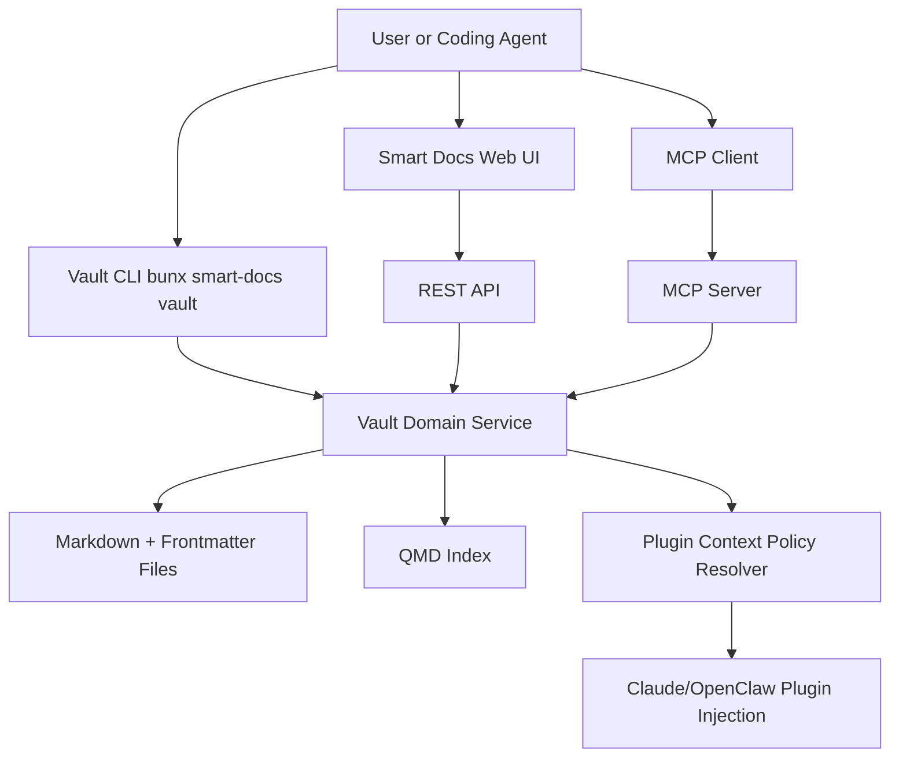

# Vault CLI Spec (Bun-first)

## Purpose
Define a stable, ergonomic CLI contract for operating a Vault OS repo from local terminals and coding agents.

Design intent:
- **Bun-first runtime** for speed and simple distribution.
- **Deterministic machine-friendly output** for agents/automation.
- **Shared domain contract** across CLI, web app, REST API, plugin context loader, and MCP server.

## Packaging and invocation

### Primary entrypoint
- `bunx smart-docs vault <command> [options]`

### Installed global/local entrypoint
- `smart-docs vault <command> [options]`

### Compatibility alias (optional, transitional)
- `npx @hhopkins/smart-docs vault <command> [options]`

Bun is the canonical runtime for docs/examples. `npx` remains compatibility-only.

---

## Command surface (v1)

### Top-level groups
- `vault init` — scaffold or validate vault structure
- `vault doctor` — health checks (schema, links, index, policy)
- `vault search` — retrieval across indexed/non-indexed content
- `vault get` — fetch one object by path/id
- `vault create` — create managed object from template/type
- `vault update` — patch metadata/body via managed write path
- `vault move` — relocate object (e.g., PARA transitions)
- `vault link` — create typed relations between docs
- `vault validate` — run schema and policy validation
- `vault index` — control indexing lifecycle
- `vault context` — plugin/MCP context previews and policy checks
- `vault run` — execute workflow/skill wrappers
- `vault export` — package vault contracts/templates for portability

### Subcommands and flags

#### `vault init`
- `vault init [path]`
- Flags:
  - `--preset vault-os|personal|team`
  - `--force`
  - `--dry-run`
  - `--json`

Creates required folders, starter standards, and config file if missing.

#### `vault doctor`
- `vault doctor`
- Flags:
  - `--strict`
  - `--fix` (safe, non-destructive fixes only)
  - `--json`

Runs composite checks and exits non-zero on failures.

#### `vault search`
- `vault search <query>`
- Flags:
  - `--type <type>` (repeatable)
  - `--tag <tag>` (repeatable)
  - `--status <status>`
  - `--owner <owner>`
  - `--limit <n>`
  - `--semantic` / `--lexical` / `--hybrid`
  - `--json`

#### `vault get`
- `vault get <path-or-id>`
- Flags:
  - `--format markdown|json|frontmatter`
  - `--json`

#### `vault create`
- `vault create <type> <title>`
- Flags:
  - `--path <dir>`
  - `--template <name>`
  - `--meta key=value` (repeatable)
  - `--stdin-body`
  - `--json`

#### `vault update`
- `vault update <path-or-id>`
- Flags:
  - `--set key=value` (frontmatter patch, repeatable)
  - `--append <markdown>`
  - `--replace-body <file>`
  - `--json`

#### `vault move`
- `vault move <path-or-id> <target>`
- Flags:
  - `--reason <text>`
  - `--update-links`
  - `--json`

#### `vault link`
- `vault link <from> <to>`
- Flags:
  - `--relation depends_on|references|implements|supersedes|child_of`
  - `--bidirectional`
  - `--json`

#### `vault validate`
- `vault validate [path-or-glob]`
- Flags:
  - `--schema v1`
  - `--policy default|strict|custom`
  - `--fail-on warn|error`
  - `--json`

#### `vault index`
- `vault index build`
- `vault index watch`
- `vault index status`
- `vault index clean`
- Flags:
  - `--json`

#### `vault context`
- `vault context preview`
- `vault context resolve`
- `vault context explain`
- Flags:
  - `--mode minimal|standard|deep`
  - `--max-documents <n>`
  - `--json`

#### `vault run`
- `vault run workflow <workflow-id>`
- `vault run skill <skill-id>`
- Flags:
  - `--input <json-or-file>`
  - `--dry-run`
  - `--json`

#### `vault export`
- `vault export contract`
- `vault export templates`
- Flags:
  - `--out <path>`
  - `--json`

---

## UX conventions

### Output modes
1. **Human mode (default)**
   - concise colored summaries
   - warnings and remediation hints
2. **JSON mode (`--json`)**
   - stable schema, no prose noise
   - deterministic keys and exit semantics

### Exit code contract
- `0` success
- `1` general failure
- `2` validation/policy failure
- `3` not found
- `4` conflict (link/move/update conflict)
- `5` configuration resolution failure

### Error object (JSON mode)
```json
{
  "ok": false,
  "error": {
    "code": "VALIDATION_FAILED",
    "message": "2 documents violate required metadata",
    "details": [{ "path": "docs/tasks/t1.md", "missing": ["status"] }]
  }
}
```

### Safety defaults
- no destructive action without explicit flag (`--force`, `--fix`, etc.)
- `--dry-run` available on write-like operations
- managed writes always pass through validation hooks

---

## Config resolution

Config file: `smart-docs.config.json` (repo root)

Resolution order (highest precedence first):
1. CLI flags
2. Environment variables (`SMART_DOCS_*`)
3. Repo config (`smart-docs.config.json`)
4. Preset defaults (`vault-os`, `personal`, `team`)
5. Built-in safe defaults

### Relevant config sections
```json
{
  "vault": {
    "preset": "vault-os",
    "schemaVersion": "v1"
  },
  "agentContext": {
    "mode": "standard",
    "maxDocuments": 20,
    "allowRoles": ["instructions", "reference"],
    "denyPaths": ["archives/**"]
  },
  "index": {
    "engine": "qmd",
    "watch": true
  }
}
```

### Environment variable mapping (examples)
- `SMART_DOCS_VAULT_PRESET=team`
- `SMART_DOCS_AGENT_MODE=deep`
- `SMART_DOCS_AGENT_MAX_DOCUMENTS=50`
- `SMART_DOCS_INDEX_ENGINE=qmd`

If resolved config is invalid, CLI returns exit code `5` with actionable diagnostics.

---

## Relationship: CLI vs Plugin vs MCP vs REST API

- **CLI**: operator interface for humans + coding agents in terminal/CI.
- **REST API**: app-facing HTTP boundary used by web UI and external callers.
- **Plugin context loader**: startup-time doc injection policy (`autoLoad`, role, priority).
- **MCP server**: structured tool/resource boundary for runtime agent operations.

Shared rule: all write paths should converge on the same domain validation logic.



### Contract principle
- CLI command semantics should map cleanly to API/MCP operations:
  - `vault search` ↔ `GET /api/vault/search` ↔ `vault.search`
  - `vault validate` ↔ `POST /api/vault/validate` ↔ `vault.validate`
  - `vault link` ↔ `POST /api/vault/link` ↔ `vault.link`

This avoids divergent behavior between local scripts, UI actions, and agent tool calls.

---

## Coding agent examples (Bun-first)

### 1) Validate repo before edits
```bash
bunx smart-docs vault validate --policy strict --json
```

### 2) Find active tasks related to indexing
```bash
bunx smart-docs vault search "index lag" \
  --type task --status active --hybrid --limit 10 --json
```

### 3) Create a decision doc with metadata
```bash
bunx smart-docs vault create decision "Adopt Bun-first CLI" \
  --meta status=draft \
  --meta owners=platform \
  --meta tags=cli,bun,architecture \
  --json
```

### 4) Link task to workflow
```bash
bunx smart-docs vault link \
  docs/tasks/task-improve-indexing.md \
  docs/workflows/workflow-index-rebuild.md \
  --relation implements --json
```

### 5) CI gate pattern
```bash
bunx smart-docs vault doctor --strict --json
bunx smart-docs vault validate --policy strict --fail-on warn --json
```

---

## Implementation notes (phased)

### Phase A (minimum viable CLI)
- `init`, `validate`, `search`, `index status`, `context preview`

### Phase B (managed mutation)
- `create`, `update`, `move`, `link` with strict safety and dry-run

### Phase C (agent execution + portability)
- `run workflow|skill`, `export contract|templates`

Keep command and JSON contracts versioned; introduce breaking changes only behind explicit major version bumps.
