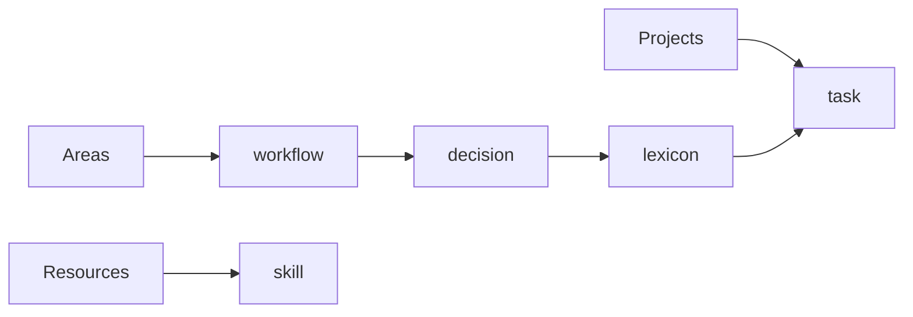

# Vault Demo (Dogfood)

This section demonstrates the proposed Vault model in a **small, practical, docs-first setup**.

It includes:

- A sample **PARA layout** with realistic docs
- Typed examples for **task, workflow, skill, decision, and lexicon**
- A short guided walkthrough showing how a team can run day-to-day work

## Demo map

## Start here

- [PARA sample vault](para/README.md)
- [Typed object examples](objects/task-publish-vault-demo.md)
- [Guided walkthrough](walkthrough.md)

## Design goals

- Keep docs understandable by humans first
- Make metadata predictable for automation
- Keep relationships explicit (`related`, `owners`, `status`, `review_by`)
