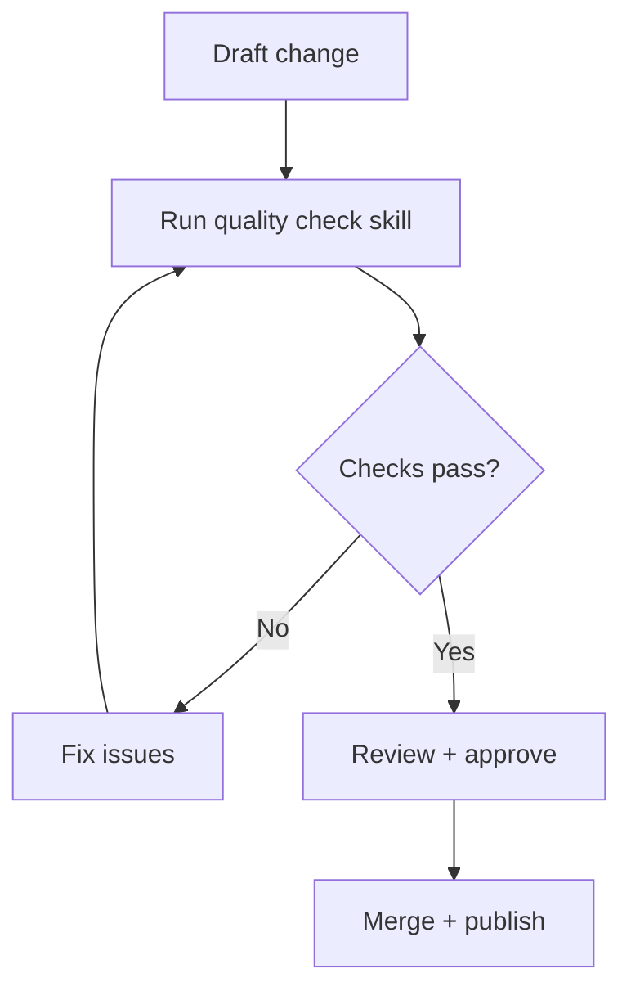

# Document Publish Loop

A repeatable process for drafting, validating, and publishing docs.

## Steps
1. Draft content in PARA context
2. Run quality checks
3. Resolve lint/links/frontmatter issues
4. Request review
5. Merge and publish
