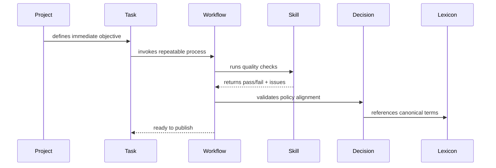

# Guided Walkthrough

Use this 7-step walkthrough to dogfood the model in a real docs cycle.

1. Open the project doc: [Customer Onboarding Revamp](para/projects/customer-onboarding-revamp.md)
2. Start the execution item: [Publish Vault Demo task](objects/task-publish-vault-demo.md)
3. Follow the process: [Document Publish Loop](objects/workflow-doc-publish-loop.md)
4. Run validation via: [Run Doc Quality Check](objects/skill-run-doc-quality-check.md)
5. Confirm metadata policy: [Frontmatter v1 Decision](objects/decision-adopt-frontmatter-v1.md)
6. Align terminology: [Vault Object Lexicon](objects/lexicon-vault-objects.md)
7. Publish and archive outcomes in PARA as needed

## End-to-end trace

